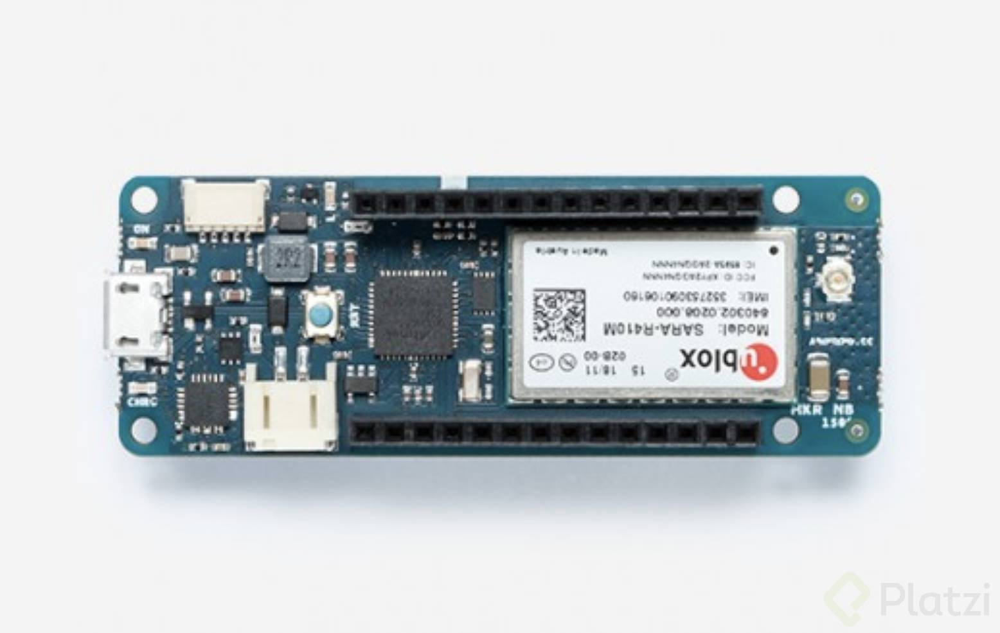

# CURSO PLATZI

**Espectro electromagnetico:**

* 4 fuerzas fundamentales

* ondas de menos y mas energias - espectros.

* radiofrecuencia -  telecomunicaciones. 

* Onda mecanica generadapor una cuerda, genera perturbacion seguida, la cuerda se empieza a mover.

     - hertz la cantidad de perturbacion. 

* Onda electromatica seguida, onda eltrofrecuencia.

* insertar imagen  

* Ondas electromagneticas con mucha energia, son ondas elctromagneticas con mucha frecuencia.

# Clasificacion en la radio frecuencia:

* 3KHz - 30 KHz Very Low Frecuency (VLF) submarinos y aviones
* 30KHz - 300 KHz Low Frecuency (LF) rango militar y radioaficionados
* 300KHz - 3000 KHz Mediun Frecuency (MF)
emisoras de radio AM 

* 3 - 30 Mhz High Frecuency (HF) sistemas de ayuda militar. navegando en el mar.

* 30 - 300 Mhz  Very High Frecuency (VHF)
radio FM y televion analogica. 

* 300 - 3000 Mhz Ultra High Frecuency (UHF) GPS - red celular y wifi.

* 3 - 30 Ghz Super High Fecuency (SHF)
Satelity y wifi 

* 30 - 300 Extremely High Frecuency  (EHF) 
Radio telescopios y ?

# Regulacion de las radios frecuencias

* ITU - Union Internacional de Telecomunicaciones 

* Bandas licenciadas - Bandas libres.
* Exclusividad de esas frecuencias.
* Banda libre no se paga por exclusividad.
* ISM 

# ¿Qué son las Telecomunicaciones?
Una telecomunicación es la transmisión y recepción de datos por medio de perturbaciones en el campo electromagnético. Esta puede darse de forma alámbrica o inalámbrica.

**Elementos:**

* Líneas de transmisión
* Emisor / Receptor
* Modulación / Demodulación
* Ruido

# Halfduplex y Fullduplex
Todos los sistemas de telecomunicaciones son Half-duplex o Full-duplex.

**Half-duplex:** Es una comunicación bidireccional que sólo puede darse una vez en el tiempo. Un ejemplo son los Walkie Talkies con los que sólo una persona puede hablar a la vez. Suele haber una banda con un canal.
Una banda con un canal.

**Full-duplex:** Trabaja como las redes celulares y puede recibirse y enviar información todo al mismo tiempo. Suele haber una banda con dos canales.

Para hacer lo anterior posible es necesario el uso de distintos canales que son las frecuencias que están dentro de las bandas que se usan en las conexiones.
Una banda con varios canales.

# Clasificación de transmisiones: Upstream y Downstream
Cuando estamos en sistemas avanzados de telecomunicaciones como WiFi, Bluetooth o las redes celulares, es necesario tener definiciones para saber cuándo estamos transmitiendo información al servidor y cuándo estamos bajando información desde el servidor.

**Upstream y Downstream** clasifican un nodo o una conexión como la compuerta de enlace a internet. El que recibe la perturbación electromagnética la va a decodificar y la subirá a un protocolo de internet conocido.
Las conexiones que van del nodo a internet son upstream y las que van del servidor al nodo son downstream.

# Presupuesto de enlace
La potencia de transmisión normalmente se mide en vatios, pero en radiofrecuencia se mide en decibeles. Un decibel es una unidad de medida adimensional en escala logarítmica.

Las antenas de transmisión pueden ser resumidas en dos tipos:

     - Omnidireccionales: Transmite en todas las direcciones.

     -  Direccionales: Muy común en antenas antiguas de televisión analógica.

Todos los cables tienen pérdidas y decibeles.

Una onda de radio en el vacío tiene pérdidas muy grandes.

# Wi-fi
La cantidad de bits al transmitir un mensaje depende de la modulación. El ancho de banda es la cantidad de frecuencias que ocupa la perturbación para transmitir un mensaje completo.

WiFi es una de las tecnologías más usadas en todo el mundo y trabaja sobre una frecuencia ISM la cual no está licenciada. Es muy seguro porque las claves están encriptadas.
Su nombre es IEEE 802.11 y trabaja sobre dos bandas: 2.4 GHz y 5 GHz.

Características:

* Alto ancho de banda
* Uso industrial y doméstico
* Universalidad
* Acceso directo a internet
* CI ya integrados con WiFi
* Buena seguridad
* Banda ISM
* Alto consumo energético
* Stack de red complejo de implementar
* Poca penetración de señal
* Poca sensibilidad

# Bluetooth
**Bluetooth** es bastante conocido y se usa en computadores y celulares conectando teclados, mouse, audífonos, entre otros. Es un conjunto de tecnologías que van desde la 1.0 hasta la 5.0. Trabaja sobre la misma banda ISM de WiFi 2.4 GHz.

Comenzó siendo un protocolo de la **IEEE** pero ahora el encargado de mantenerlo es **Bluetooth Special Interest Group.**

Características:

* Alto ancho de banda
* Uso industrial y doméstico
* Universalidad
* Versión BLE de bajo consumo
* Red tipo malla
* Distintas versiones
* Banda ISM
* Stack de red complejo de implementar
* No hay acceso directo a internet
* Hay que agregar seguridad
* Compatibilidad obsoleta en ciertos SO

# Redes celulares
Las redes celulares son un conjunto de tecnologías que han evolucionado gracias a una organización llamada TGPP que se encarga de establecer los estándares para las tecnologías **1G, 2G, 2.5G, 3G y 4G.**

Las empresas proveedoras deben pagar a los gobiernos un licenciamiento por las redes que van a estar usando ya que se trabaja sobre frecuencias licenciadas para establecer conexiones estables y controlables.

Características:

* Conectividad mundial
* Conectividad a internet directa
* Seguridad incorporada
* Implementación sencilla
* Gran disponibilidad
* Bandas licenciadas
* Uso alto de energía
* Módulos que pueden ser grandes y caros
* Cargos mensuales
* La cobertura puede variar
* Rangos de frecuencias que cambian en diferentes países

Desde 2G ya internet 
3G encriptacion SSL 

5G actualiza: antena frecuencia, canales.
antena con cierto receptor, compatibles entre si. 

# Consideraciones para implementación de NB-IoT

Si bien las tecnologías NB-IoT o LTE-MTC están siendo implementadas por empresas transnacionales como lo es AT&T, Verizon, T-mobile su implementación no está aún cerca de las redes 3G, 4G ya instaladas las cuales ofrecen una cobertura prácticamente mundial.

Esta tecnología es aún muy reciente y por lo mismo tenemos que asegurarnos de tomar las precauciones necesarias.

Este es un mapa mundial que puedes encontrar [aquí](https://www.gsma.com/iot/deployment-map/) el cual es actualizado por la GSMA quien es mantenida por la 3GPP (3rd Generation Partnership Project).

Con esto podemos concluir que esta tecnología es funcional para el internet de las cosas y es muy probable que al momento de estar totalmente implementada sea una gran diferencia para este mundo, trayendo consigo muchísimos proyectos a un bajo coste de renta para la conexión a internet, pero por el momento no es viable generar dispositivos completamente compatibles para usar solo esta tecnología. Por eso hay que estar listos para el cambio y prever que nuestros dispositivos con estas necesidades estén listos para esta evolución.

Una de las recomendaciones que te damos es que uses módulos que sean fáciles de implementar y que tengan una buena documentación.

Esto es fundamental, pues sin una fácil implementación una producción en serie de tus dispositivos será más costosa de llevar a cabo y estará más propensa a tener errores, entre más simple mantengas el ensamble y el diseño, tu producto será menos propenso a errores. La buena documentación es una parte fundamental al momento de crear tu dispositivo, pues de esta manera podrás tener una curva de aprendizaje mucho más reducida sobre el uso del mismo módulo.

Uno de los módulos que te recomendamos aquí en Platzi es el UBLOX SARA-R410M-02B, lo puedes encontrar en la tarjeta de desarrollo MKR NB 1500 en la página oficial de Arduino, este Arduino es compatible con LTE-MTC y NB-IoT.

También si estás buscando una implementación más económica puedes optar por el SIM7020 en páginas como Aliexpress, este módulo es compatible con los mismos comandos usados por el módulo SIM800, también es compatible con sus pines, por tanto si creas un dispositivo que incluya el módulo SIM800 es posible que tu dispositivo evolucione a un SIM7020, este módulo es compatible también con la red 3G, por tanto si en tu región aún no hay implementación puedes hacer uso de otras redes celulares y tener listo tu dispositivo para la evolución a LTE-MTC o NB-IoT.

Como el SIM7020 es compatible con el SIM800 puedes hacer diseños y dispositivos con el SIM800 para que sea más económico, y cuando tengas la red NB-IoT o bien LTE-MTC estés listo para migrar al SIM7020.

# NB-IoT
Las **LPWAN’s** son redes de largo alcance, gran cobertura y un consumo bajo de energía. Esto se logra haciendo una transmisión de datos pequeña con un ancho de banda pequeño, ahorrando energía para más penetración.

**NB-IoT** es un conjunto de tecnologías como las redes celulares y está igualmente sobre una banda licenciada, se ofrecen junto a servicios de 5G. Las frecuencias varían dependiendo de la región y hay un pago mensual menor que el de redes celulares.

Características:

* Bajo consumo energético
* Conectividad a internet directa
* Seguridad incorporada
* Gran disponibilidad
* Bandas licenciadas
* Ancho de banda limitado
* Cargos mensuales
* La cobertura puede variar
* Velocidades de transmisión lentas
* Rangos de frecuencias que cambian en diferentes países

